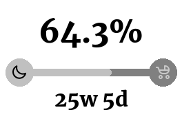
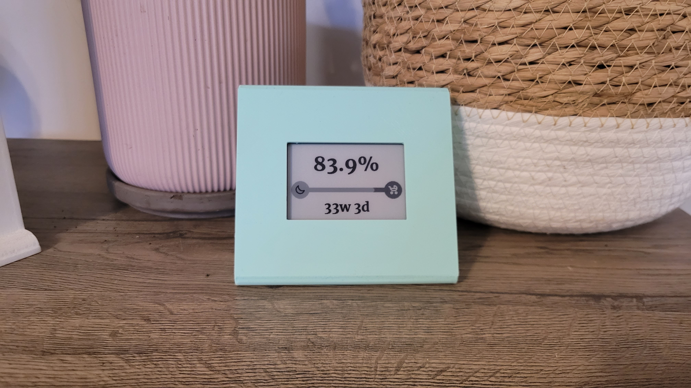

# E-ink Pregnancy Tracker

A simple project that displays the status of a pregnancy using [2.7 inch e-Paper HAT by Waveshare](https://www.waveshare.com/2.7inch-e-paper-hat.htm). Meant to be run on a Raspberry Pi.





## Setup
1. Configure your Raspberry Pi according to the [docs provided by Waveshare](https://www.waveshare.com/wiki/2.7inch_e-Paper_HAT_Manual#Working_With_Raspberry_Pi).
2. Clone this repo:
    ```
    git clone https://github.com/grappeq/e-ink-pregnancy-tracker.git
    ```
3. Install dependencies:
    ```
    pip3 install -r requirements.txt
    ```
4. Install libopenjp2 required by Pillow:
    ```
    sudo apt-get install libopenjp2-7
    ```
5. Copy the `config.json.example` file as `config.json` and set the expected birth date.
6. Configure cron to run the `main.py` file on a schedule (e.g. every 30 mins).

## Testing
If you wish to try out the package locally, you can run the `local_test.py` file. The script generates the image and displays it on your screen without the need of relying on packages that are available only on Raspberry Pi.

## Useful resources
* [2.7 inch e-Paper HAT docs](https://www.waveshare.com/wiki/2.7inch_e-Paper_HAT)
* [Model of the case for the display and Raspberry Pi Zero](https://www.printables.com/model/538237-27-inch-e-ink-display-raspberry-pi-zero-case) (visible on the photo above)